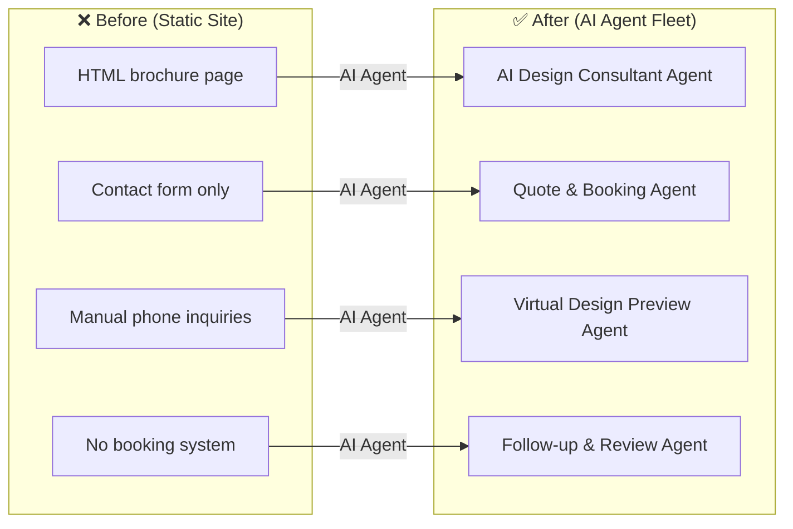
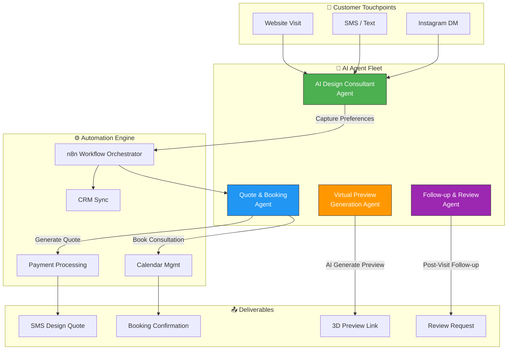

# 🏎️ Joe's Car Design — AI Agent-Powered Automotive Customization Platform

> **Before:** Static brochure website on Surge.sh  
> **After:** AI agent-driven automotive design & booking ecosystem

---

## 🌐 Live Site (Original)
**URL:** [joes-car-design.surge.sh](https://joes-car-design.surge.sh)  
**Tech:** React + Vite (Static)  
**Status:** Archived — transformed into AI agent showcase

---

## ❌ The Problem

Custom automotive shops rely on walk-ins, phone calls, and Instagram DMs to generate leads — but most inquiries go unanswered after hours. Customers want to know vehicle modification pricing and availability but get radio silence until the next business day. By then they've called 3 other shops. No instant quotes, no virtual previews, no booking system — just missed opportunities from a static brochure website.

**Before:** Static brochure site, phone-only inquiries, 24hr+ response time, no instant quoting, no booking system, lost leads daily.

**After (AI Agent Fleet):** AI Design Consultant engages visitors 24/7 via SMS/web, AI generates instant quotes + preview links, AI books shop appointments automatically, AI follows up post-visit for reviews and referrals. 3x more booked builds.

---

## 🤖 Before vs After: AI Agent Transformation

## 🧠 AI Agent Architecture

## 🚀 What the AI Agents Do

### 1. 🎨 AI Design Consultant Agent
- Engages visitors via chatbot, SMS, or DM
- Captures vehicle make/model, desired modifications, budget range
- Classifies inquiry: paint, body kit, interior, performance, full custom
- Routes to appropriate workflow

### 2. 💰 Quote & Booking Agent
- Generates instant pricing based on modification type + vehicle
- Sends SMS quote with payment link
- Books consultation/shop appointment via calendar sync
- Sends confirmation with prep checklist

### 3. 🖼️ Virtual Preview Generation Agent
- Uses AI image generation to create visual mockups of proposed modifications
- Delivers preview link via SMS/email
- Collects feedback: approve, revise, or cancel

### 4. 📋 Follow-up & Review Agent
- Sends post-visit thank-you + review request
- Tracks project status and notifies customer at milestones
- Generates monthly portfolio from completed builds
- Re-engages past customers for referral program

## 📁 Repository Contents

| File | Description |
|------|-------------|
| `index.html` | Original site HTML |
| `assets/` | Static assets (CSS/JS) |
| `README.md` | This file — AI agent documentation |

## 📊 Business Impact

| Metric | Before | After (Projected) |
|--------|--------|-------------------|
| Lead Response Time | 4–24 hrs | < 30 seconds |
| Quote Generation | Manual estimate | Instant AI pricing |
| Booking Rate | Unknown | 3x via instant booking |
| Customer Follow-up | None | Automated 7-day sequence |

---

Built by **[Shazaly Musa](https://github.com/SparkSpheartech)** — Founder, SparkSphear Tech  
*AI Agents for Automotive Customization & Service Businesses*