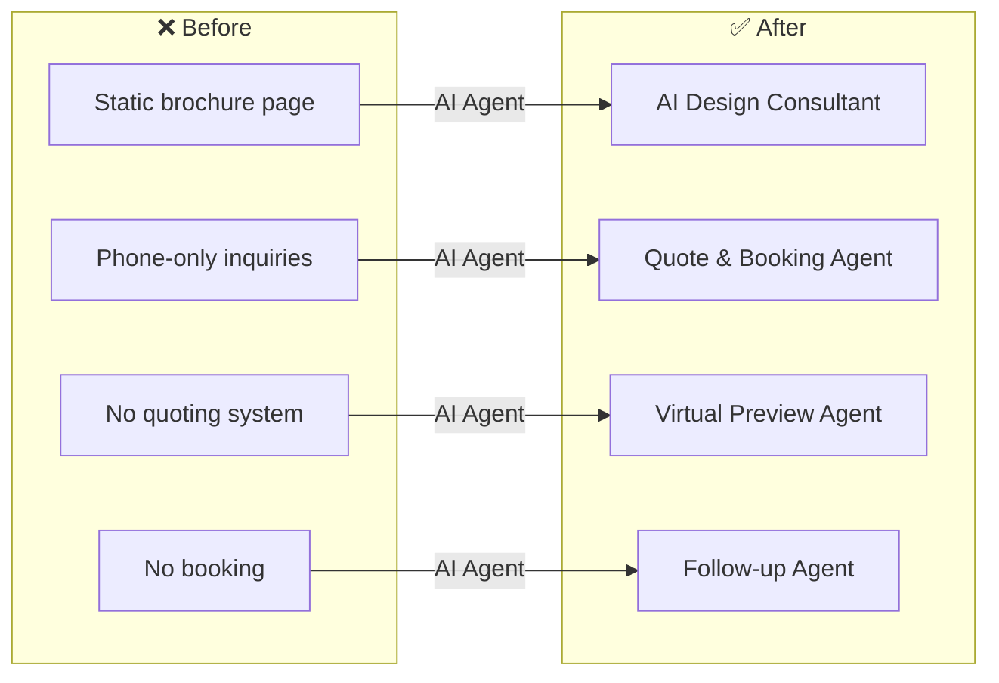
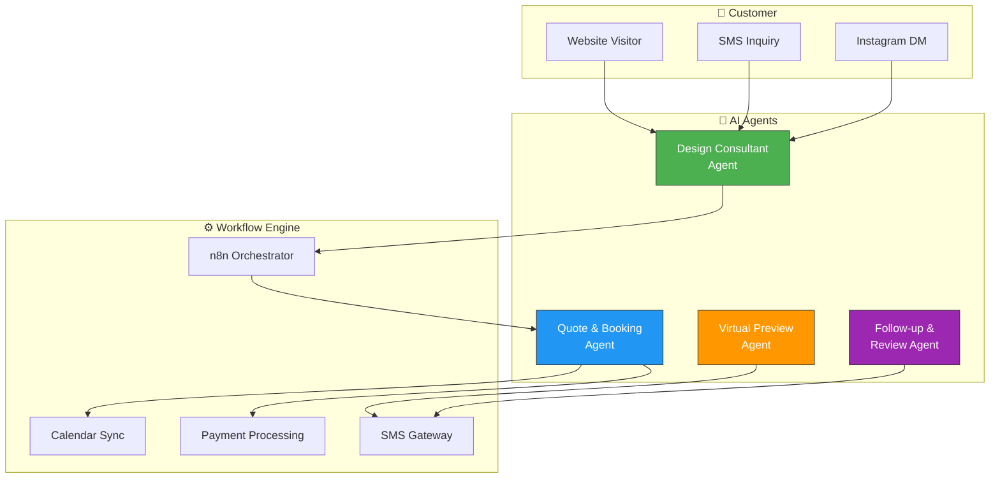

# 🏎️ Automotive Customization — AI Agents for Custom Auto Shops

> SPARKSPHEAR builds AI agents for automotive customization workflows across custom auto shops, vehicle wrap studios, body shops, and performance garages.

**Start With the Workflow. Scale What Works.**

We audit the system, connect the tools that fit, and automate the work that does not require constant manual attention.

---

## ❌ The Problem

Custom automotive shops rely on walk-ins, phone calls, and Instagram DMs to generate leads — but most inquiries go unanswered after hours. Customers ask about modification pricing and availability and get radio silence until the next business day. The owner does everything — and the business plateaus.

**Before:** Static brochure site, phone-only inquiries, 24hr+ response time, no instant quoting, no booking system, lost leads daily.

**After (AI Agent Fleet):** AI Design Consultant engages visitors 24/7, AI generates instant quotes, AI books shop appointments automatically, AI follows up post-visit for reviews and referrals. 3x more booked builds.

---

## 🤖 AI Agent Fleet

Four AI agents working in concert to turn every inquiry into a booked build.

### Architecture

### Answer and route
The AI Design Consultant handles approved inquiries about vehicle modifications, pricing, and availability. It captures the vehicle make, model, year, and desired work — then sends the right consultation path or booking link.

### Bring clients back
Use service-specific return windows (paint cure follow-up, wrap inspection at 30 days, seasonal package upgrades) to flag overdue clients and prepare owner-approved check-in messages.

### Keep control
Price approvals, custom design sign-offs, and deposit requirements stay behind permissions, escalation rules, and human review. The agent assists; you remain responsible.

---

## 🚀 Start With One Workflow

We do not start by selling the biggest package. We start by auditing the workflow and identifying the smallest useful agent.

**Workflow Audit — Starting at $297 one-time**
- Current workflow map
- Bottleneck analysis
- Existing-tool review
- Data and access requirements
- Agent suitability assessment
- Three prioritized automation opportunities
- Recommended first agent
- Implementation scope
- Measurement and acceptance plan

**Implementation — One-time build fee**
- Agent development and testing
- Approved integration setup
- Escalation rule configuration
- Acceptance criteria verification

**Monthly Agent Operation — Recurring package fee**

| Package | Price | Best For |
|---------|-------|----------|
| **SIGNAL START** | $297/mo | One narrow workflow, one primary channel, one or two approved integrations |
| **FLOW CONTROL** | $697/mo | Several related workflows with routing, follow-up, and exception handling |
| **SYSTEM LIFT** | $1,497/mo | Multiple workflows, channels, custom rules, and meaningful reporting |
| **SCALE CONTROL** | from $2,997/mo | Multi-location, operations-heavy, custom APIs and dashboards |

This maps to **FLOW CONTROL** — several related workflows (inquiry handling, quoting, booking, follow-up) with routing between agents and exception handling for custom work approvals.

---

## 🌐 Live Site (Original)

**URL:** [joes-car-design.surge.sh](https://joes-car-design.surge.sh)  
**Tech:** React + Vite (Static)  
**Status:** Archived — transformed into AI agent showcase

---

Built by **[Shazaly Musa](https://github.com/SparkSpheartech)** — Founder, SparkSphear Tech  
*Start With the Workflow. Scale What Works.*  
*AI Agents for Automotive Customization*